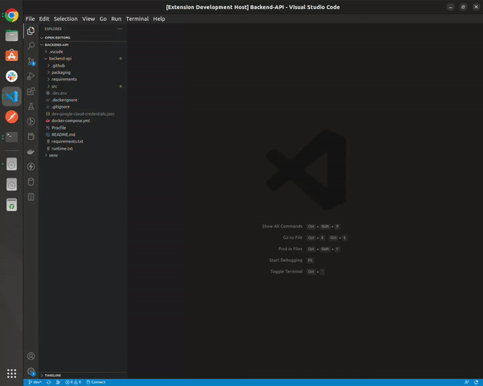

# Qnotly

## Introduction
Qnotly, is a vscode extension to take code notes, by highliting the code you want, then save it, and show notes related in every file in the currrent workspace.

## Features
1. Create Qnote.
2. List File Qnotes When clicking on file.
3. Delete Qnote.
4. List All Qnotes in Currennt Workspace




---
## Getting Started

### Installation
* Clone Repo.
* Go to the Parent Folder in the repo Then Open VSCode
    ```
    code .
    ```
* Install requirements 
    ```
    npm install
    ```
* Run Project Using `F5`.

### VSCode Marketplace
Search marketplace by word `qnotly` or `Qnotly`, it should show extension to download.
[Qnotly in Marketplace Link](https://marketplace.visualstudio.com/items?itemName=Qnotly.qnotly)


---
## Contact
* Email: `abdoaslam000@gmail.com`

Do not hasitate to contact me.


---
## License
Distributed under the MIT License. See `LICENSE` for more information.


## Code Of Conduct
See `CODE_OF_CONDUCT.md` for more information.


## Security
See `SECURITY.md` for more information.


## Changelog
All Qnotly changes and releases notes. See `CHANGELOG.md` for more information.


---
## Release Notes

### 0.6.0
### Added
- Show all qnotes button
- Show current file qnotes
- Show Qnote file and it's tooltip for full file path

**Enjoy!**
