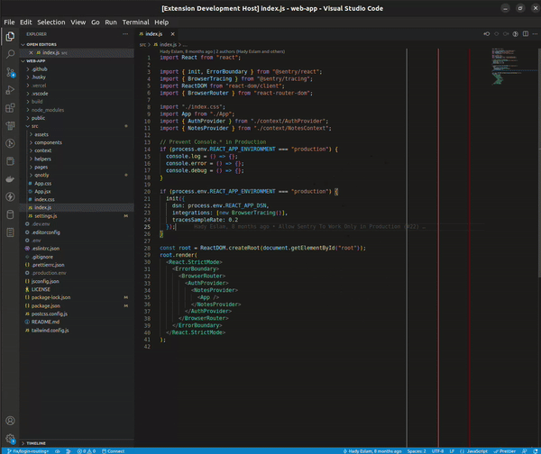
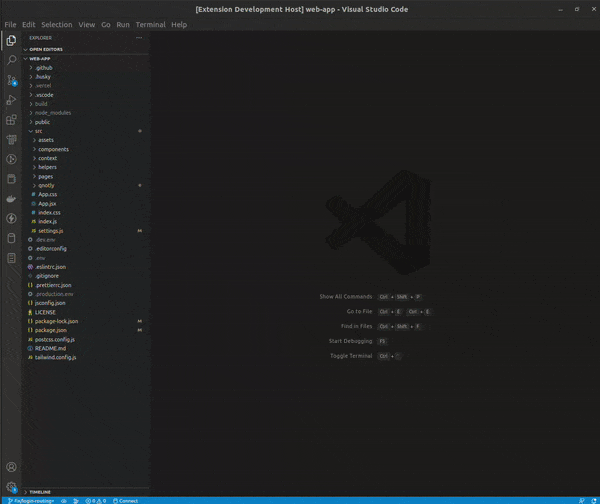
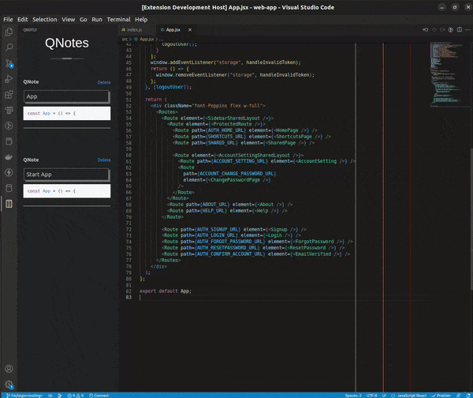

# Qnotly

## Introduction
Qnotly, is a vscode extension to take code notes, by highliting the code you want, then save it, and show notes related in every file in the currrent workspace.

## Features

1. Save Qnote:


2. List Qnote:


3. Delete Qnote



---
## Getting Started

### Installation
* Clone Repo.
* Go to the Parent Folder in the repo Then Open VSCode
    ```
    code .
    ```
* Install requirements 
    ```
    npm install
    ```
* Run Project Using `F5`.


---
## Contact
* Email: `abdoaslam000@gmail.com`


---
## License
Distributed under the MIT License. See `LICENSE` for more information.


## Code Of Conduct
See `CODE_OF_CONDUCT.md` for more information.


## Security
See `SECURITY.md` for more information.


## Changelog
All Qnotly changes and releases notes. See `CHANGELOG.md` for more information.


---
## Release Notes

### 0.1.4
Initial Release of QNotly, VSCode Extension.
What's New
1. Save Code Qnote
2. Show File Qnotes
3. Delete Qnote

**Enjoy!**
